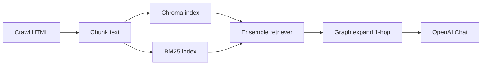

# HyperMesh / OptiStruct マニュアル RAG デモ

Altair **HyperMesh / OptiStruct** の日本語オンラインマニュアルを対象に、**ハイブリッド検索（ベクトル + BM25）**と **ハイパーリンクに基づく検索結果の拡張**を組み合わせた [RAG](https://en.wikipedia.org/wiki/Retrieval-augmented_generation) アプリです。質問応答は **Streamlit** 上で行います。

**参照マニュアルのトップ URL（例）**  
https://2021.help.altair.com/2021/hwsolvers/ja_jp/os/index.htm

---

## デモ

動画やスクリーンショットをここに置くと、ポートフォリオとして分かりやすくなります。

- （任意）録画 GIF / 動画リンク
- （任意）Streamlit 画面のキャプチャ

過去に掲載した操作デモ（GitHub アセット）:

https://github.com/user-attachments/assets/541d6e79-bc7a-4f95-8f14-961c7642fb81

---

## 概要

- マニュアル HTML を **同一ホスト上で幅優先（BFS）取得**（`requests` + LangChain `extract_sub_links` + BeautifulSoup）し、本文とページ間リンクをメタデータに保持します。
- チャンク化したテキストを **Chroma（ベクトル）** と **BM25** の両方で検索し、**EnsembleRetriever** で統合します。
- 各チャンクの `metadata["links"]` を用い、**検索でヒットしたページのリンク先**から追加チャンクを取り込みます（1-hop。本格的な GraphRAG のコミュニティ要約などは含みません）。
- 回答生成には **OpenAI API**（例: `gpt-4o-mini`）を使用します。**埋め込み**は **Hugging Face** の多言語モデル（`intfloat/multilingual-e5-large`）を利用します。検索用途では公式推奨どおり **`query:` / `passage:`** プレフィックスを付与します（`data_utils.huggingface_e5_embedding_kwargs`）。
- **BM25** は日本語向けに **`data_utils.bm25_tokenize_japanese`**（空白区切りに加え、日本語は文字単位・英数字トークンはそのまま）でトークン化します。従来の `text.split()` のみだと、スペースのない日本語質問が 1 トークンになり検索がほぼ効きません。

### 著作権・利用について

マニュアル本文の**著作権は Altair 等の権利者に帰属**します。本リポジトリは**マニュアル本文の再配布は行いません**。索引データ（`vectorstore`、`split_documents.pkl` 等）は、各自の環境で `load_data.py` を実行して生成してください。公開サイトの利用条件・robots.txt を遵守してください。

---

## 主な機能

| 機能 | 説明 |
|------|------|
| ハイブリッド検索 | ベクトル類似度（Chroma）と BM25 の加重結合 |
| グラフ拡張検索 | ヒットページの `links` 先からチャンクを追加（Streamlit サイドバーで ON/OFF・上限調整） |
| マニュアル取得 | 同一ホストの **BFS（幅優先）** で HTML を取得（`extract_sub_links` + `requests`）。`max_depth` は起点 URL からの **ホップ数の上限**（0 が起点のみ） |
| Streamlit UI | 温度・k・ベクトル重み、**参照資料の表示上限**、**ベクトル関連度しきい値**、グラフ拡張パラメータの調整 |
| タイミングログ | `load_data.py` / ローダーで区間ごとの所要時間を表示 |
| 参照資料の出し分け | ベクトル検索の最良スコアがしきい値未満なら **参照 0 件**（プロンプトも資料なし）。以上ならハイブリッド結果の先頭から **表示上限件数**まで |

---

## アーキテクチャ（概要）



---

## 技術スタック

| 区分 | 技術 |
|------|------|
| オーケストレーション | LangChain（`langchain-core` / `langchain-community` / `langchain-chroma` / `langchain-classic` 等） |
| ベクトルストア | Chroma |
| 埋め込み | Hugging Face（`sentence-transformers` / `torch`） |
| スパース検索 | BM25（`rank-bm25`） |
| LLM | OpenAI API（`langchain-openai`） |
| UI | Streamlit |
| HTML 解析 | BeautifulSoup4、`requests` |

---

## ディレクトリ構成（抜粋）

```text
rag_project/
├── README.md
├── requirements.txt
├── .env                    # 各自作成（Git 管理外推奨）
├── data/                   # split_documents.pkl 等（生成物・.gitignore 想定）
├── src/
│   ├── app.py              # Streamlit アプリ
│   ├── load_data.py        # インデックス構築（下記パイプライン）
│   ├── data_loader.py      # CLI: フルクロール → crawled_documents.pkl + hyperlink_graph.json
│   ├── data_utils.py       # split 保存/読込、E5 設定、BM25 トークン化、GPU/CPU 判定
│   ├── graph_retrieval.py  # グラフ拡張リトリーバ
│   └── loaders/
│       ├── __init__.py
│       └── altair_manual_loader.py
└── vectorstore/            # Chroma 永続化（生成物・.gitignore 想定）
```

---

## セットアップ

### 前提

- Python 3.11+ 推奨（開発時は 3.14 等でも可。未検証環境は要確認）
- OpenAI API キー（回答生成用）

### インストール

```bash
cd /path/to/rag_project
python -m venv .venv
.venv\Scripts\activate          # Windows
# source .venv/bin/activate    # macOS / Linux

pip install -r requirements.txt
```

初回は Hugging Face の埋め込みモデル取得で時間がかかることがあります。

**GPU（埋め込み）:** `torch` は CUDA 対応ビルドを別途入れる必要があります（`pip install torch` の CPU 版だけでは GPU は使えません）。RTX 50 系（Blackwell）では **CUDA 13.x 系の PyTorch wheel**（例: `+cu130`）と **新しい NVIDIA ドライバ**が必要な場合があります。`data_utils.resolve_embedding_torch_device()` が **CUDA → MPS → CPU** を自動選択します（`RAG_EMBEDDING_DEVICE=cpu` で固定可）。

**Chroma と E5 プレフィックス:** `query:` / `passage:` を変えたあとは、**必ず `load_data.py` で vectorstore を作り直す**必要があります（古いベクトルと混在させない）。

### 環境変数

プロジェクトルートに `.env` を作成し、例として次を設定します。

```env
OPENAI_API_KEY=sk-...
```

`load_data.py` / `app.py` は `python-dotenv` で `.env` を読み込みます。

---

## 使い方

作業ディレクトリは **`src`** に合わせると、`vectorstore` の相対パスと `data/split_documents.pkl` のパスがそのまま一致します。

### 1. インデックス構築（初回・マニュアル更新時）

#### データの流れ（推奨）

| ステップ | スクリプト | 成果物 | RAG で使うか |
|----------|------------|--------|----------------|
| ① フルクロール（必要なときだけ） | `data_loader.py` | `data/crawled_documents.pkl`, `data/hyperlink_graph.json` | pickle は `load_data` の入力。JSON は分析・デバッグ用（`app.py` は未使用） |
| ② インデックス構築 | `load_data.py` | `vectorstore/`, `data/split_documents.pkl` | **必須**（Chroma + BM25） |

`crawled_documents.pkl` が既にあり内容が十分なら、**② だけ**で構いません。

#### ② インデックス構築

```bash
cd src
python load_data.py
```

- 既定では **`../data/crawled_documents.pkl` があればそれを読み込み**、なければ `load_altair_manual_documents` でクロールします。
- チャンク分割・埋め込み（E5 + `query:`/`passage:`）・Chroma 書き込み・`../data/split_documents.pkl` 保存まで行います。チャンク数はマニュアル規模により **数万件・インデックス作成に長時間**（GPU 利用時は埋め込みが短縮されやすい）かかります。
- 再クロールだけしたいとき: `data_loader.py` を実行。pickle を使わずクロールからやり直すとき: 環境変数 `RAG_FORCE_CRAWL=1` で `load_data.py` を実行。
- `max_depth` は [`load_data.py`](src/load_data.py) 内の `load_altair_manual_documents(..., max_depth=8)` で変更できます（大きいほど取得ページが増え、時間も増えます）。
- 全ページに近い頻度で出るリンクを `metadata["links"]` から落とす処理の強さは、同ファイルの `COMMON_LINK_RATIO_THRESHOLD`（または環境変数 `RAG_COMMON_LINK_RATIO`）で変えられます。`None` または `RAG_COMMON_LINK_RATIO=off` で無効化できます（ナビ除外後の候補リンクをそのまま `links` に使います）。

#### ① フルクロール（任意）

```bash
cd src
python data_loader.py --help
# 例: 出現頻度による共通リンク除去をオフにする
python data_loader.py --common-link-ratio off
```

### 2. アプリ起動

```bash
cd src
python -m streamlit run app.py
```

Windows で `streamlit` コマンドが PATH にない場合でも、`python -m streamlit` なら動くことが多いです。

### 3. インデックスを作り直したあと

Streamlit の **`@st.cache_resource`** が古いバンドルを掴むことがあります。データ更新後は **アプリの再起動**、または Streamlit メニューから **キャッシュのクリア**を試してください。

---

## 主なパラメータ

| 場所 | 内容 |
|------|------|
| `load_data.py` | `start_url`、`max_depth`、チャンクサイズ / overlap、Embedding モデル名、`COMMON_LINK_RATIO_THRESHOLD`（共通リンク除去の比率。`None` で無効）または環境変数 `RAG_COMMON_LINK_RATIO`（`off` で無効、数値で比率） |
| `app.py` サイドバー | `k`、ベクトル重み、**参照資料の表示上限（件）**、**ベクトル関連度しきい値**、グラフ拡張の有無・追加チャンク上限・リンク先あたりのチャンク数 |
| 環境変数 | `RAG_EMBEDDING_DEVICE`（`cpu` / `cuda` / `mps`）、`RAG_FORCE_CRAWL`（`1` で pickle を無視してクロール）、`RAG_COMMON_LINK_RATIO` |

---

## 既知の制限

- クロールは **開始 URL と同一ホスト**（`extract_sub_links` の `prevent_outside`）に限定されます。`metadata["links"]` に含まれる別サブドメインの URL は、リンク情報としては残り得ますが、自動ではクロールされません。
- グラフ拡張は **1-hop のルールベース**であり、学習型の GraphRAG ではありません。
- **回答と参照 URL が一致しないことがある:** プロンプトと「参照資料」欄は、**同じ検索結果チャンク**（表示上限件数まで）から作られます。専用ページ（例: `mat1_bulk_r.htm`）がインデックスにあっても、ハイブリッド検索の順位で上位に来ないと **参照欄にはその URL は出ません**。一方、別ページのチャンクに `MAT1` 等の記述がある場合や LLM の一般知識により、**回答本文だけは期待どおり**になることがあります。
- BM25 の日本語トークンは **文字単位の簡易分割**です。形態素解析やカード名辞書によるブーストは未実装です。

---

## 今後の検討例（検索精度の改善）

現状は **E5 プレフィックス + 日本語向け BM25 + 関連度しきい値** まで反映済みです。さらに精度を上げる候補:

- クロスエンコーダによるリランク
- クエリ拡張・カード名（`MAT1` 等）のブースト、参照表示と回答の整合（canonical URL の明示）
- 形態素解析ベースの BM25 トークン化
- 評価（RAGAS 等）と代表質問セットでの回帰確認
- Streamlit Community Cloud / Render 等へのデプロイ手順の整理
- より広い Altair 製品ドキュメントへの拡張

---

## ライセンス

本リポジトリの**サンプルコード部分**のライセンスは、リポジトリに `LICENSE` があればそれに従います（未配置の場合は各自の利用方針にご注意ください）。**マニュアル本文の利用**は公式サイトの条件に従ってください。

---

**Last updated:** 2026年5月
